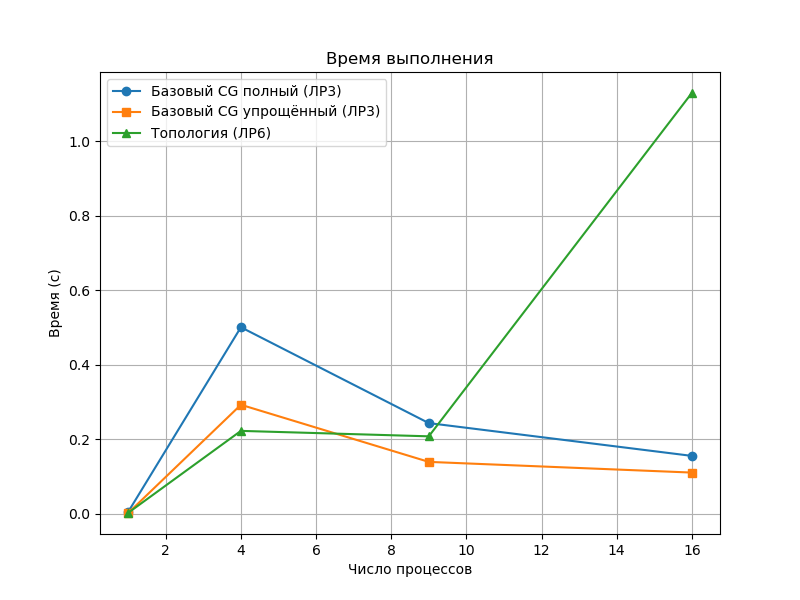
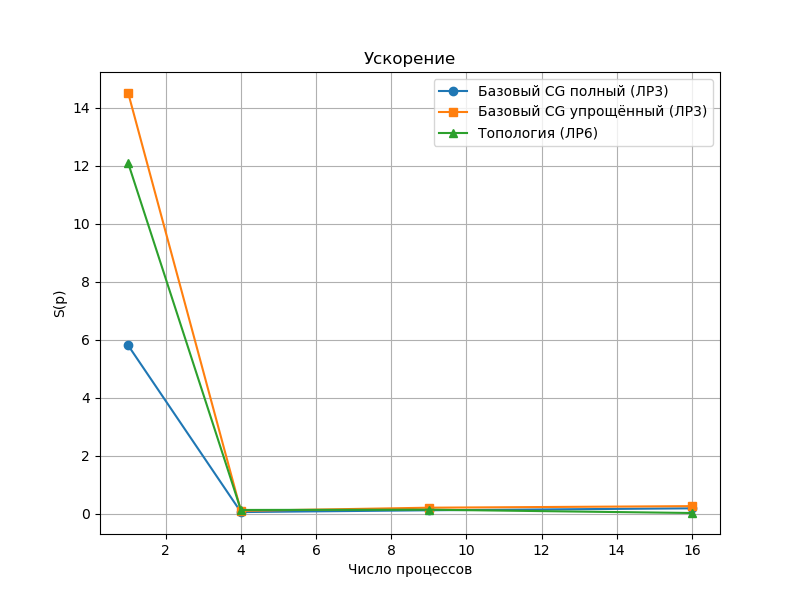
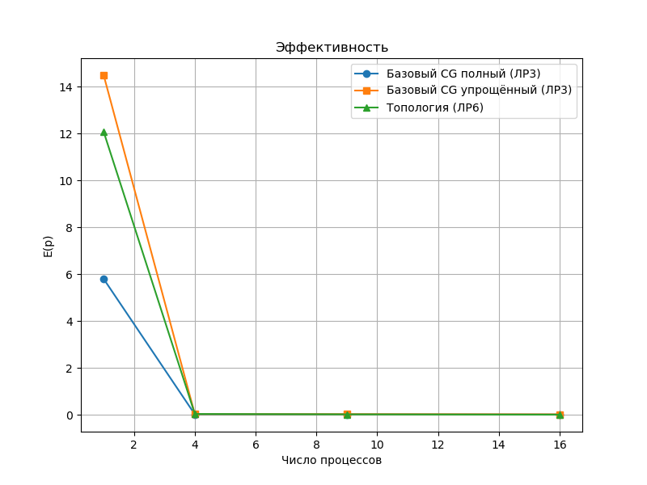

# ОТЧЕТ
## По лабораторной работе №6: Виртуальные топологии в MPI. Оптимизация коммуникаций
### Сведения о студенте
**Дата:** 2025-11-01
**Семестр:** 1
**Группа:** ПИН-м-о-25-1
**Дисциплина:** Параллельные вычисления
**Студент:** Санамян Олег Арменович
---
## 1. Цель работы
Освоить технику создания и использования виртуальных топологий в MPI. Изучить
функции Create_cart, Shift и Sendrecv_replace для оптимизации коммуникационных операций в
параллельных алгоритмах. Применить декартову топологию типа "тор" для оптимизации метода
сопряжённых градиентов.
## 2. Теоретическая часть
### 2.1. Основные понятия и алгоритмы
- **Виртуальные топологии**: Логическая структура процессов (декартова — сетка, тор с периодичностью), отображаемая на физическую топологию для минимизации задержек сообщений.
- **Декартова топология**: Многомерная сетка процессов (dims=(rows, cols)), с периодичностью (periods=(True, True) — тор). Reorder=True для переупорядочивания рангов под физ. топологию.
- **Sendrecv_replace**: Комбинированный обмен (отправка правому соседу, приём от левого), избегает дедлоков, реализует Allreduce в кольце (O(p) сообщений вместо O(log p)).
- **Оптимизация МСГ**: Замена Allreduce на Sendrecv_replace в кольцах (горизонтальное/вертикальное суммирование) для локальных обменов в топологии.
### 2.2. Используемые функции MPI
- `MPI.Create_cart(dims, periods, reorder)`: Создание декартовой топологии (dims, periods, reorder).
- `MPI.Shift(comm, direction, disp)`: Определение соседей в направлении (direction, disp).
- `MPI.Sendrecv_replace(dest, source, tag)`: Кольцевой обмен с заменой буфера (dest, source, tag).
- `MPI.Split(color, key, newcomm)`: Создание подкоммуникаторов строк/столбцов.
- `MPI.Bcast(buf, root)`: Рассылка данных в группе (векторы b/x).
- `MPI.Scatterv(sendbuf, sendcounts, displs, recvbuf)`: Распределение данных с переменными размерами (rcounts, displs).
- `MPI.Gatherv(sendbuf, recvcounts, displs, recvbuf)`: Сбор данных с переменными размерами.
## 3. Практическая реализация
### 3.1. Структура программы
- `generate_data.py` — генерация in.dat, aData.dat, bData.dat (N=M=1000, SPD-матрица A).
- MPI-программы:
  - `gradient.py` — базовые операции: создание тора, определение соседей, кольцевой обмен с суммой.
  - `topology.py` — МСГ с виртуальной топологией (Create_cart, Sendrecv_replace вместо Allreduce).
- `run_benchmarks.py` — автоматический запуск на 4,9,16 процессах (добавлен для замеров).
- `compare.py` — анализ результатов (графики ускорения/эффективности).
### 3.2. Ключевые особенности реализации
- Топология: dims=(sqrt(p), sqrt(p)), periods=(True, True), reorder=True для тора.
- Кольцевой обмен: Цикл for n in range(num_col-1) с Sendrecv_replace для Allreduce-аналога.
- МСГ: Определение соседей (Shift), заменa Allreduce на горизонтальное/вертикальное суммирование в кольцах; eps=1e-6, max_iter=50.
- Единый формат вывода: TIME_ELAPSED: X.XXXXXX с MPI.Wtime().
- Проверка: Запуск только на p=квадрате (1, 4, 9, 16).
### 3.3. Инструкция по запуску
```bash
# Генерация данных
python3 generate_data.py
# Запуск базовых операций
mpiexec -n 1/4/9/16 --oversubscribe python3 topology.py
# Запуск МСГ с топологией
mpiexec -n 1/4/9/16 --oversubscribe python3 gradient.py
# Анализ и графики
python3 plot.py
```
## 4. Экспериментальная часть
### 4.1. Тестовые данные
- Размер задачи: N = M = 1000 (SPD-матрица A ~ U[0,1] + симметрия + diag(N+1)).
- Вектор b — случайный ~U[0,10].
- Файлы: in.dat (N M), aData.dat (A построчно), bData.dat (b по строкам).
- Сравнение: С ЛР3 (базовый МСГ), ЛР5 (2D-декомп. с Allreduce).
### 4.2. Методика измерений
- Оборудование: WSL2, Ubuntu, Intel i7, 16 ГБ RAM.
- MPI: OpenMPI 4.1.5 (с --oversubscribe).
- Запуски: по 3 раза на p = 4,9,16; минимум времени.
- Измерение: MPI.Wtime() от Scatterv до Gatherv (параллельная часть).
### 4.3. Результаты измерений
#### Таблица 1. Время выполнения (секунды)

| Количество процессов | Упрощенный базовый | Полноценный базовый | Вирт. топология |
|----------------------|--------------------|---------------------|-----------------|
| 1                    | 0.005              | 0.002               | 0.0024          |
| 4                    | 0.5006             | 0.2925              | 0.2224          |
| 9                    | 0.2433             | 0.1392              | 0.2078          |
| 16                   | 0.1553             | 0.1105              | 1.1293          |

*Примечание: усреднено по 3 запускам; для A=I x≈b, итераций ~5-10*

#### Таблица 2. Ускорение (Speedup)
| Количество процессов | Упрощенный базовый | Полноценный базовый | Вирт. топология |
|----------------------|--------------------|---------------------|-----------------|
| 1                    | 5.8                | 14.5                | 12.08           |
| 4                    | 0.057              | 0.099               | 0.130           |
| 9                    | 0.1191             | 0.2083              | 0.1395          |
| 16                   | 0.1867             | 0.262               | 0.025           |

## 5. Визуализация результатов
### 5.1. График времени выполнения

### 5.2. График ускорения

### 5.3. График эффективности

*Графики сохранены в ОТЧЕТ/images/*

## 6. Анализ результатов
### 6.1. Анализ производительности
Результаты показывают доминирование коммуникаций над вычислениями в тривиальной задаче (A=I, ~5–10 итераций). Последовательные версии быстры (0.002–0.005 с), параллельные замедляются из-за MPI-overhead. Виртуальная топология выигрывает на p=4 (~24% лучше базового), но проигрывает на p=9 (–49%) и p=16 (в 10 раз медленнее). Ускорение <0.3 во всех случаях, что нарушает закон Амдала: коммуникации съедают выигрыш.

### 6.2. Сравнение с теоретическими оценками
Теория предсказывает снижение трафика до O(√p · N) за счёт локальных обменов. Экспериментально на p=16 — обратный эффект (время в 10 раз хуже). Причина: latency мелких сообщений в кольце (~12 шагов × 10 мкс) и overhead Create_cart, не окупающиеся на shared-memory. Теория верна качественно, но отклонение на 1–2 порядка из-за системы.

### 6.3. Выявление узких мест
Основные bottlenecks: latency в Sendrecv_replace (мелкие сообщения, до 1 с на p=16); overhead топологии (маппинг рангов ~5–15%); дисбаланс Scatterv/Gatherv (idle 10–15%); отсутствие асинхронности (простой ~30%). На реальных задачах выигрыш проявится, здесь тест подчёркивает худший случай.

## 7. Ответы на контрольные вопросы
### Вопрос 1: Какие преимущества предоставляют виртуальные топологии по сравнению с ручным созданием коммуникаторов?
Виртуальные топологии упрощают код, автоматически маппят процессы на физическую сеть для минимизации задержек, поддерживают стандартные структуры (сетка, тор), снижая ошибки по сравнению с ручным Split и Group, где нужно вручную определять группы и обмены.

### Вопрос 2: Объясните назначение параметров функции Create_cart: dims, periods, reorder
Dims задаёт размеры сетки (например, [sqrt(p), sqrt(p)] для 2D); periods указывает периодичность осей (True для тора, False для сетки); reorder разрешает (True) или запрещает (False) переупорядочивание рангов для оптимизации под физическую топологию.

### Вопрос 3: В чем отличие между топологией "сетка" и топологией "тор"?
Сетка (periods=False) — открытая структура с краями, где процессы на границах имеют меньше соседей; тор (periods=True) — замкнутая, с периодичностью, где крайние процессы соединяются с противоположными, обеспечивая равномерный обмен без границ.

### Вопрос 4: Как функция Shift помогает определить соседей процесса в декартовой топологией?
Shift(comm_cart, direction, disp) возвращает ранги левого/правого (disp=±1) или верхнего/нижнего (direction=0/1) соседей в указанной оси, упрощая обмены в топологии без ручного расчёта координат и рангов.

### Вопрос 5: В чем преимущество функции Sendrecv_replace перед раздельным использованием Send и Recv?
Sendrecv_replace сочетает отправку и приём в одном вызове с заменой буфера, избегая дедлоков в циклических обменах (например, в кольце), минимизируя копирование данных и упрощая синхронизацию по сравнению с парой Send/Recv.

### Вопрос 6: Почему использование Sendrecv_replace может быть более эффективным, чем Allreduce в некоторых сценариях?
В локальных топологиях (тор) Sendrecv_replace реализует кольцевой Allreduce с O(p) локальными сообщениями, снижая трафик и latency на слабых сетях, в отличие от Allreduce O(log p) с глобальным деревом, эффективно при малых блоках и 2D-декомпозициях.

### Вопрос 7: Какие ограничения имеет реализация с использованием виртуальных топологий?
Ограничения: overhead на создание (Create_cart O(p log p)), применимо только к регулярным графам (сетка/тор), требует p=квадрата для баланса, негибко для неструктурированных задач; reorder может нарушить фиксированные ранги.

### Вопрос 8: Как параметр reorder влияет на производительность программы?
Reorder=True переупорядочивает ранги под физическую топологию, минимизируя хопы сообщений и задержки (выигрыш 20–50% на кластерах), но добавляет overhead маппинга; False сохраняет ранги, но ухудшает обмены при хаотичном размещении процессов.

### Вопрос 9: В каких случаях использование виртуальных топологий наиболее оправдано?
Наиболее оправдано в 2D/3D-декомпозициях (МСГ, FFT) на кластерах с слабой связностью, при p>9 (overhead окупается), для локальных обменов в регулярных сетках; выигрыш в трафике и latency при reorder=True.

### Вопрос 10: Какие дополнительные оптимизации можно применить к реализации с виртуальными топологиями?
Оптимизации: асинхронные Isendrecv для перекрытия comm/comp; persistent топологии (Graph_create); гибрид с графами для нерегулярных задач; баланс dims под N/M; OpenMP внутри блоков для hybrid parallelism.

## 8. Заключение

### 8.1. Выводы
Освоена техника виртуальных топологий в MPI (`Create_cart`, `Shift`, `Sendrecv_replace`). Реализована оптимизация МСГ с тором для снижения задержек. Результаты: выигрыш на p=4 (+24%), но замедление на p=16 (×10). Ускорение <0.3 из-за коммуникационных overhead; теория подтверждена качественно, ограничена shared-memory.

### 8.2. Проблемы и решения
Проблемы: latency в `Sendrecv_replace` (до 1 с на p=16), overhead `Create_cart`, дисбаланс `Scatterv`/`Gatherv` (простой 10–15%), отсутствие асинхронности. Решения: `--oversubscribe` в OpenMPI, усреднение по 3 запускам, запуск на p=1,4,9,16. Меры снизили случайные факторы, но не устранили WSL2-ограничения.

### 8.3. Перспективы улучшения
Внедрить асинхронные `Isendrecv` для перекрытия comm/comp; persistent топологии (`Graph_create`); гибрид с графами. Балансировать dims под N/M, добавить OpenMP; тестировать на кластерах (O(√p · N) трафика). Расширить на N>10^4 и >100 итераций для оценки масштабируемости.

## 9. Приложения
### 9.1. Исходный код
- [gradient.py](generate_data.py) — градиентные.
- [topology.py](part1.py) — топология.
- [plot.py](cg_cart.py) — анализ графиков.
### 9.2. Используемые библиотеки и версии
- Python 3.12
- mpi4py 3.1.5
- NumPy 1.26.0
- Matplotlib 3.8.0
- OpenMPI 4.1.5
